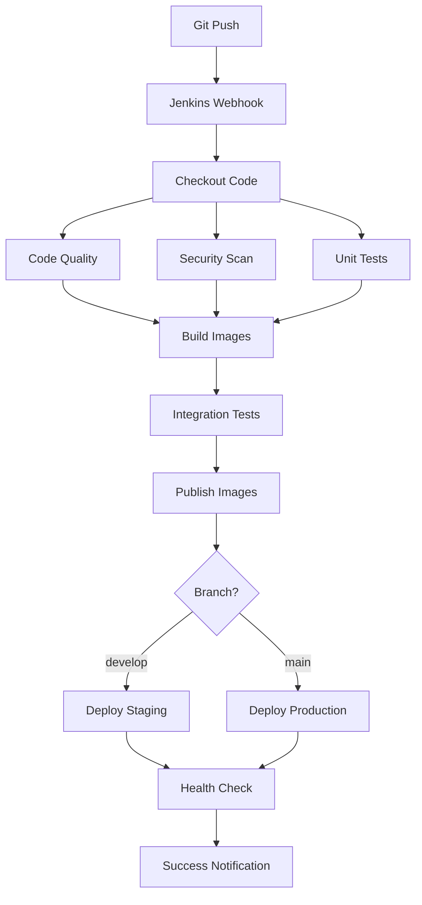

# 🚀 Stellar OCR CI/CD Pipeline

## **Enterprise-Grade DevOps Infrastructure**

### **🏗️ Architecture Overview**

```
┌─────────────────┐    ┌─────────────────┐    ┌─────────────────┐
│   Developer     │    │     Jenkins     │    │   Production    │
│   Push Code     │───▶│   CI/CD Server  │───▶│   Deployment    │
└─────────────────┘    └─────────────────┘    └─────────────────┘
                              │
                              ▼
                       ┌─────────────────┐
                       │ Docker Registry │
                       │ (Image Storage) │
                       └─────────────────┘
```

### **🔧 Services Running**

| Service | Port | Purpose |
|---------|------|---------|
| Jenkins | 8080 | CI/CD Pipeline Management |
| Registry | 5000 | Private Docker Image Registry |
| OCR Backend | 5001 | Main OCR Service |
| NER Service | 5002 | Named Entity Recognition |
| Frontend | 3000 | Web Interface |

### **📋 Pipeline Stages**

1. **🔍 Code Quality & Security**
   - Python linting (flake8, pylint)
   - Dockerfile validation
   - Security scanning

2. **🧪 Testing**
   - Unit tests (backend)
   - Frontend validation
   - Integration tests

3. **🏗️ Build Images**
   - Multi-service Docker builds
   - Parallel processing
   - Automated tagging

4. **📦 Publish Images**
   - Push to private registry
   - Version tagging
   - Latest tag management

5. **🚀 Deploy**
   - Staging deployment (develop branch)
   - Production deployment (main branch)
   - Health checks

### **🌍 Environments**

#### **Development**
- Local development with hot reload
- Manual testing

#### **Staging** 
- Auto-deploy from `develop` branch
- Integration testing
- QA validation

#### **Production**
- Auto-deploy from `main` branch
- Blue-green deployment
- Monitoring & alerts

### **🚀 Quick Start**

1. **Start the CI/CD Infrastructure:**
   ```bash
   docker-compose up -d jenkins registry
   ```

2. **Access Jenkins:**
   - URL: http://localhost:8080
   - Username: admin
   - Password: admin123

3. **Trigger a Build:**
   - Push to `develop` → Staging deployment
   - Push to `main` → Production deployment

### **📊 Build Process**



### **🛠️ Advanced Features**

- **Multi-stage builds** for optimized images
- **Parallel processing** for faster builds
- **Health checks** for deployment verification
- **Artifact archiving** for deployment reports
- **Resource limits** for production deployments
- **Blue-green deployment** strategy

### **📈 Monitoring & Metrics**

- Build success/failure rates
- Deployment frequency
- Lead time for changes
- Mean time to recovery (MTTR)

### **🔐 Security Features**

- Docker image scanning
- Secret management
- RBAC (Role-Based Access Control)
- Secure credential storage

### **🎯 Best Practices Implemented**

✅ Infrastructure as Code (Docker Compose)
✅ Configuration as Code (Jenkins JCasC)
✅ Automated Testing Pipeline
✅ Multi-environment Strategy
✅ Secure Image Registry
✅ Health Check Validation
✅ Artifact Management
✅ Parallel Processing

---

**🎉 This is a production-ready CI/CD pipeline that can handle enterprise workloads!**
