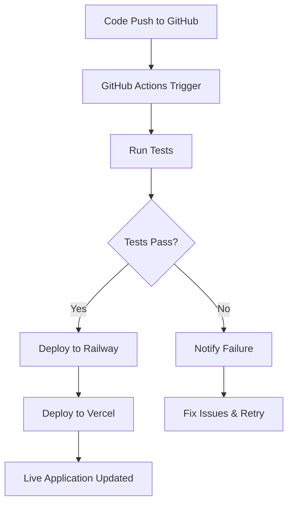

# 🚀 Stellar OCR - Cloud Deployment Guide

## **Deploy Your OCR App to the Cloud for FREE!**

This guide will walk you through deploying your Stellar OCR application to the cloud using free services.

---

## 📋 **Prerequisites**

1. **GitHub Account** (free)
2. **Railway Account** (free - 500 hours/month)
3. **Vercel Account** (free - unlimited static deployments)

---

## 🗂️ **Deployment Architecture**

```
┌─────────────────┐    ┌─────────────────┐    ┌─────────────────┐
│   GitHub Repo   │───▶│   Railway.app   │◀───│  Vercel.com     │
│   (Source Code) │    │   (Backend)     │    │   (Frontend)    │
└─────────────────┘    └─────────────────┘    └─────────────────┘
        │                       │                       │
        ▼                       ▼                       ▼
   CI/CD Pipeline         OCR API Server          Web Interface
```

---

## 🚀 **Step-by-Step Deployment**

### **Step 1: Prepare Your Repository**

1. **Initialize Git Repository:**
   ```bash
   git init
   git add .
   git commit -m "Initial commit: Stellar OCR application"
   ```

2. **Create GitHub Repository:**
   - Go to [GitHub.com](https://github.com)
   - Click "New Repository"
   - Name it `stellar-ocr`
   - Make it public (required for free Vercel)

3. **Push to GitHub:**
   ```bash
   git remote add origin https://github.com/YOUR_USERNAME/stellar-ocr.git
   git branch -M main
   git push -u origin main
   ```

### **Step 2: Deploy Backend to Railway**

1. **Sign Up for Railway:**
   - Go to [Railway.app](https://railway.app)
   - Sign up with GitHub
   - Connect your GitHub account

2. **Deploy Backend:**
   - Click "New Project"
   - Select "Deploy from GitHub repo"
   - Choose your `stellar-ocr` repository
   - Railway will auto-detect the Docker setup

3. **Configure Backend:**
   - Set environment variables:
     ```
     FLASK_ENV=production
     PORT=5000
     ```
   - Railway will provide a URL like: `https://stellar-ocr-backend.up.railway.app`

### **Step 3: Deploy Frontend to Vercel**

1. **Sign Up for Vercel:**
   - Go to [Vercel.com](https://vercel.com)
   - Sign up with GitHub

2. **Deploy Frontend:**
   - Click "New Project"
   - Import your GitHub repository
   - Set build settings:
     ```
     Build Command: (leave empty)
     Output Directory: frontend
     Install Command: (leave empty)
     ```

3. **Configure Frontend:**
   - The frontend will auto-detect your Railway backend URL
   - Vercel will provide a URL like: `https://stellar-ocr.vercel.app`

### **Step 4: Set Up CI/CD Pipeline**

The GitHub Actions workflow is already configured! Every time you push to `main`:

1. **Tests run automatically**
2. **Backend deploys to Railway**
3. **Frontend deploys to Vercel**
4. **You get notifications of success/failure**

---

## 🔧 **Configuration Details**

### **Railway Configuration**
- **Dockerfile**: `backend/Dockerfile`
- **Port**: Auto-detected from `$PORT` environment variable
- **Health Check**: `GET /` endpoint
- **Auto-scaling**: Included in free tier

### **Vercel Configuration**
- **Framework**: Static HTML with React
- **Build**: No build process needed
- **Runtime**: Edge functions for global speed
- **HTTPS**: Automatic SSL certificates

---

## 🌍 **Live URLs**

After deployment, your app will be available at:

- **🌐 Frontend**: `https://stellar-ocr.vercel.app`
- **🔌 Backend API**: `https://stellar-ocr-backend.up.railway.app`
- **📊 Railway Dashboard**: Monitor usage and logs
- **📈 Vercel Analytics**: Track user engagement

---

## 📊 **Free Tier Limits**

### **Railway (Backend)**
- ✅ 500 hours/month (enough for 24/7 operation)
- ✅ 1GB RAM
- ✅ 1 vCPU
- ✅ Automatic sleep after 1 hour of inactivity

### **Vercel (Frontend)**
- ✅ Unlimited static deployments
- ✅ 100GB bandwidth/month
- ✅ Global CDN
- ✅ Automatic HTTPS

---

## 🔄 **Continuous Deployment Workflow**



---

## 🛠️ **Monitoring & Maintenance**

### **Railway Dashboard**
- Monitor API usage and performance
- View real-time logs
- Scale up if needed (paid plans)
- Database integration options

### **Vercel Analytics**
- Track user visits and performance
- Monitor Core Web Vitals
- Geographic usage distribution
- Error tracking and debugging

---

## 🔒 **Security & Best Practices**

### **Environment Variables**
```bash
# Production Backend
FLASK_ENV=production
PORT=5000

# Add these for enhanced security (optional)
SECRET_KEY=your-secret-key
CORS_ORIGINS=https://stellar-ocr.vercel.app
```

### **CORS Configuration**
The backend is configured to accept requests from any origin. For production, consider restricting to your Vercel domain.

---

## 🚨 **Troubleshooting**

### **Common Issues**

1. **Backend Deployment Fails**
   - Check Railway logs for error details
   - Ensure `requirements.txt` is correct
   - Verify Dockerfile syntax

2. **Frontend Can't Connect to Backend**
   - Check if Railway backend URL is correct
   - Verify CORS settings
   - Test backend endpoint directly

3. **CI/CD Pipeline Issues**
   - Check GitHub Actions tab for error logs
   - Verify secrets are set correctly
   - Ensure repository permissions are correct

### **Quick Fixes**

```bash
# Test backend locally
docker build -t stellar-ocr-backend ./backend
docker run -p 5000:5000 stellar-ocr-backend

# Test frontend locally
cd frontend
python -m http.server 3000
```

---

## 📈 **Scaling Options**

### **When You Outgrow Free Tiers**

1. **Railway Pro**: $5/month
   - More compute resources
   - Database integration
   - Custom domains

2. **Vercel Pro**: $20/month
   - Advanced analytics
   - Team collaboration
   - Enhanced performance

---

## 🎉 **Success!**

Once deployed, you'll have:

✅ **Professional OCR application** running 24/7
✅ **Automatic CI/CD pipeline** for easy updates
✅ **Global distribution** via CDN
✅ **Monitoring and analytics** built-in
✅ **HTTPS security** automatically enabled
✅ **Custom domain support** (both platforms)

---

## 🔗 **Useful Links**

- [Railway Documentation](https://docs.railway.app)
- [Vercel Documentation](https://vercel.com/docs)
- [GitHub Actions Guide](https://docs.github.com/en/actions)
- [Docker Best Practices](https://docs.docker.com/develop/dev-best-practices/)

---

**🎊 Congratulations! Your Stellar OCR application is now live and accessible worldwide!**
